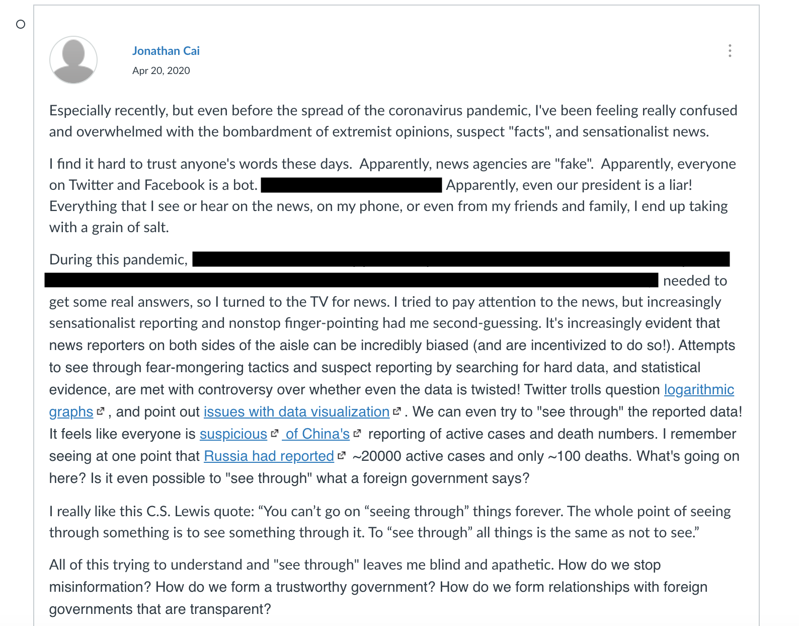

Last year I took a course at Rice called [Ethics and Accountability in Computer Science](https://courses.rice.edu/courses/!SWKSCAT.cat?p_action=COURSE&p_term=202010&p_crn=13832).

As you might guess, it was a discussion-based class covering the intersection between sociology/philosophy and computers. Case studies included autonomous vehicles, AI in judiciary decision-making and influencing hiring discrimination, the usual suspects.

I had mixed feelings for the class, but at least it made me think more about the underlying trust mechanisms at play behind many societal issues. Especially, the ongoing pandemic.

But there's one issue that I found especially pervasive:

Unfortunately, I can't offer much more than an anecdotal description of the problem.

But it seems like [I am not alone](http://citeseerx.ist.psu.edu/viewdoc/download?doi=10.1.1.940.5433&rep=rep1&type=pdf) in my complaints.

We are in unprecedented times. It's the first time in history when there is too much information. And it's not even an issue of a signal-noise ratio, because both are being blasted across the internet relentlessly. There's too much noise, and there's also too much signal, all at once.

But one can hope.

[The New Paper](https://thenewpaper.co/) is one of the best attempts at fighting sensationalist media that I've personally seen and tried out.

And as I begin working for Facebook next year, I certainly hope that the company is headed in a good direction regarding misinformation. But the road towards a meaningful solution will [most](https://www.forbes.com/sites/traversmark/2020/03/21/facebook-spreads-fake-news-faster-than-any-other-social-website-according-to-new-research/) [certainly](https://www.nytimes.com/2020/10/12/technology/on-facebook-misinformation-is-more-popular-now-than-in-2016.html) [be](https://www.reuters.com/article/usa-election-trump-tweet/update-13-twitter-facebook-fail-to-corral-trumps-misinformation-about-us-vote-count-idUSL1N2HQ0XY) [rocky](https://www.cnn.com/2020/10/09/tech/facebook-misinformation-loophole-avaaz/index.html). Decisions about censorship have been contentious at best. I'm not quite convinced Facebook, Twitter, or any private organization should be the arbiter over the fake vs. real news dichotomy.

Many feel similarly about censorship. Some are hesitant over it, some abhor it as a constitutional violation. Social platforms [Voat](https://www.theverge.com/2015/7/10/8924415/voat-reddit-competitor-free-speech) and [Parler](https://parler.com/) have sprung up in the fight against censorship.

And taking a further step back, the fake vs. real news labeling is usually more of a false dichotomy than our simple minds would like to consider. White lies, lies by omission, and strawman arguments saturate a lot of political commentary these days. Far more shades of gray than black and white.

This 2020 election has been a battle over perception and narrative. Whoever controls the media and the information channels likely has control over the narrative. Whoever controls the narrative, controls reality in everyone's mind.

We need to continue to work on making sure that each step in this pipeline is trustworthy.

We need to [invest](https://research.fb.com/blog/2020/02/facebook-misinformation-polarization-rfp-two-million-dollar-commitment/) in efforts to research misinformation.

Because damnit, I want to trust what I see again.