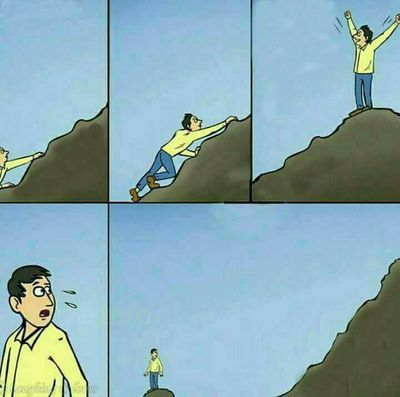
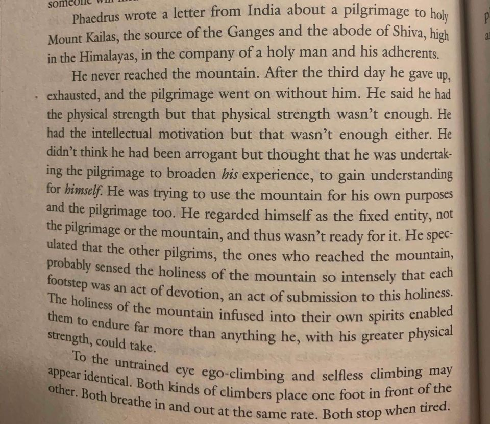
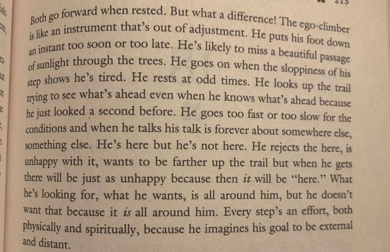
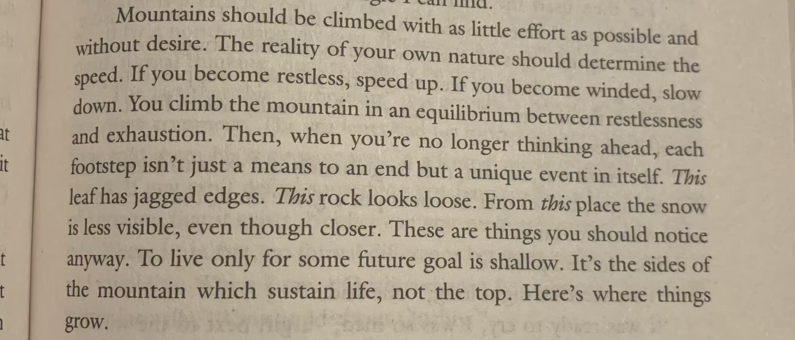

For those who haven't read Robert Pirsig's [Zen and the Art of Motorcycle Maintenance](https://www.amazon.com/Zen-Art-Motorcycle-Maintenance-Inquiry/dp/0060589469), it's about a father and a son who travel across the US on a motorcycle.

Might sound dull, but it contains lot of practical advice disguised as storytelling.

But don't take it from me, take it from [Phil Jackson](https://twitter.com/PhilJackson11/status/335974690407452672).

At one point during the story, the narrator makes a few keen observations about the two types of people who climb mountains.

**If you're too lazy to read these two pages: TL;DR the two types of mountain climbers are 1. *ego climbers* and 2. *selfless climbers*.** 

The former climb the mountain to prove something about themselves. The latter climb the mountain for the mountain's sake, as an "act of devotion" towards the mountain's "holiness".

> "[The ego climber] is here but he's not here. He rejects the here, is unhappy with it, wants to be farther up the trail but when he gets there will be just as unhappy because then it will be 'here'".

As a result, the ego-climber is out of whack. Like "an instrument that's out of adjustment". He puts his foot down sporadically, is sloppy with his movements, and rests at odd times. 

The best writing puts a mirror up to your face. And this mirror was crystal clear for me.

I was (and still am) an ego-climber.

I have always lived (and still live) steps ahead of where I currently am.

I've done my fair share of ego mountain climbing.

In high school, my mountain was basketball. I wanted to be great at basketball, be the captain of the Varsity team and score x points per game. But once I averaged x points per game, it was all about scoring x + 5 points per game. Once I became captain and earned recognition within the team, it was all about gaining league-wide recognition, and winning new awards. Granted, I was never a great basketball player, so I never reached many of these goals, but the feeling of ego-climbing only made me feel worse about failing half-way, and not appreciating that many don't reach half-way at all. In retrospect, much of it was ego-fueled. I wanted other's admiration. I wasn't always playing basketball for playing basketball's sake.

In college, I began to climb the mountain of [getting a FAANG job](https://jonathancai.com/job-search/). I spent months and years toiling over grades, resumes, referrals, interviews, portfolios, projects, all to get the chance to work at AppAmaGoogFaceSoft. Many nights I would cry and drown in anxiety about my many rejections. I was again, ego-climbing. I saw my friends receiving these awesome offers, and I couldn't help but compare. 

Pitiful.

Back to Pirsig's thoughts. In order for you to become a "selfless climber", here's what he suggests.

It's counter-intuitive. 

> Mountains should be climbed with as little effort as possible and without desire. The reality of your own nature should determine the speed. If you become restless, speed up. If you become winded, slow down.

> To live only for some future goal is shallow. It's the sides of the mountain which sustain life, not the top.

Pirsig's analogy really reminds me of the classic [Mexican fisherman story](https://www.dailygood.org/pdf/ij.php?tid=70).

And also of this quote by Marianne Williamson:

> Ego says, “Once everything falls into place I’ll feel peace.”
Spirit says, “Find your peace, and then everything will fall into place.”

If you're always thinking in the future about "what-if's" and thinking that you'll only be happy once you attain x dollars, or reach x state, you're only guaranteeing your own demise.

If the goal post is ever-moving, how can you ever reach it?. If happiness is always further up the mountain somewhere, how can you possibly be happy where you are?

You're like a hamster in a wheel.

Instead, live in the moment.

Naval would tell you to [meditate](https://twitter.com/naval/status/1261481222359801856?lang=en).

J. Cole would tell you to [love what you already have](https://jonathancai.com/love-yourz/).

Pieter Levels would tell you to [just breathe](https://levels.io/just-breathe/).

[Calm](https://www.calm.com/) would tell you to download their app.

Whatever you do, and whatever your mountain is, stop and smell the roses every once in a while.