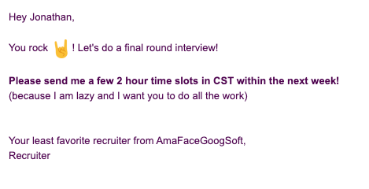
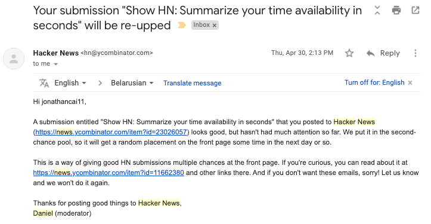
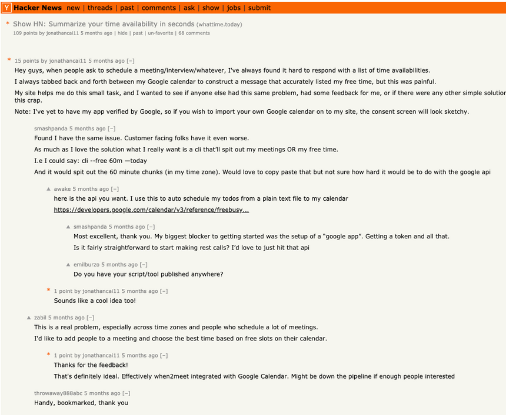
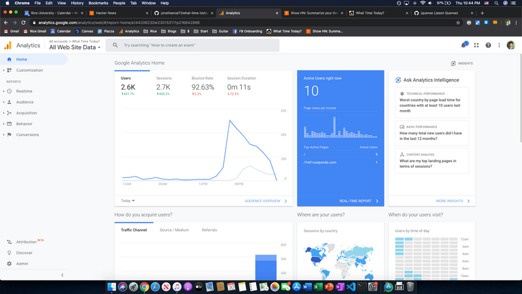
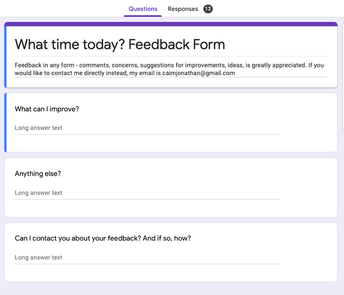
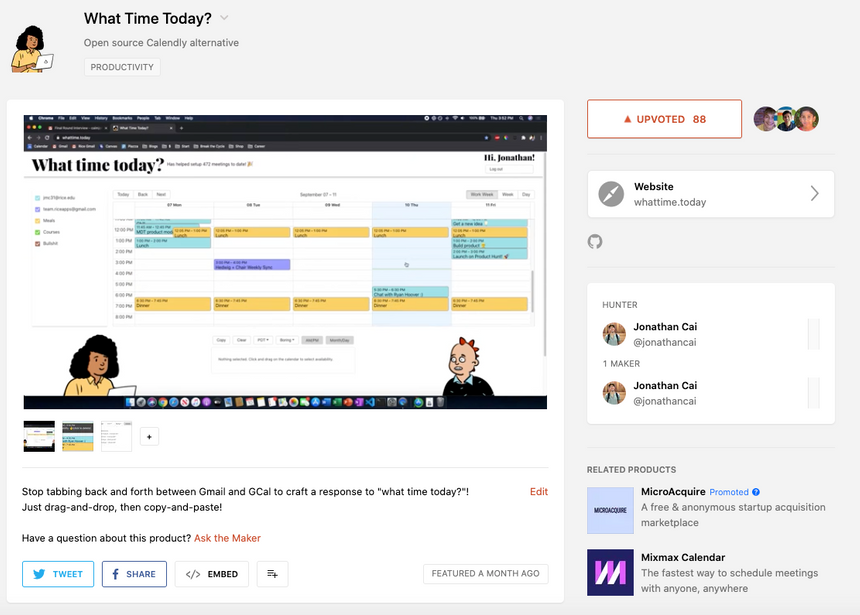

(As opposed to several of my other projects which have taken several months/years with nothing to show for it.)

### The Problem

During college internship recruiting season, recruiters often send you emails that look like this:

These emails suck. 

Not because they're moving you on to the next round of interviews. That part is awesome.

It sucks that you have to somehow email them your availability. 

So you've got to tab back and forth between your Google Calendar and Gmail to form a reasonable response that doesn't conflict with your schedule.

Sometimes this can take 10-15 minutes (at least for me).

This sucks.

This person is not making his/her life easier either. 

- You ever heard of [Calendly](https://calendly.com/)?
- It has to be in your time zone?
- How many times do you really need to find a good fit?
- How many back-and-forth emails will it take to schedule an interview?

### The Solution

So I did a little bit of research. There [are](https://calendar.management/) [many](https://availableforgmail.com/) [tools](https://www.vimcal.com/) [out](https://www.mixmax.com/calendar/?ref=producthunt) [there](https://calendly.com/) for this particular scheduling problem, but all of them have at least one of the following flaws:

- Sending impersonal links
- Installing extra software/extensions
- Registering dedicated accounts

It's too much for such a small task.

I just want to get in, and get out, and craft an easily readable response. 

I should be able to simply drag and drop, then copy and paste, to respond. And it should take seconds, not minutes.

So I built [whattime.today](http://whattime.today).

I used Node/React hosted on Google Cloud to hack this thing together over the course of a weekend. You can find the source code [here](https://github.com/jonathancai11/what-time-today).

### HackerNews

It got to the front of HackerNews by complete luck.

The moderator, Daniel, decided to just throw it up for me as a part of their "second-chance" system! You can read more about how it works [here](https://news.ycombinator.com/item?id=11662380). 

The HackerNews community is insane. 

They give you so much feedback and attention. And they always offer ways to improve the product. I was frantically updating the site to build features that were getting suggested throughout the day.

I ended up with a few thousand hits to the site and in total 75 users who even signed up to use the calendar service even with a sketchy Google unverified OAuth form.

I also received feedback through my Google Form.

### Product Hunt

Then months later I posted on [ProductHunt](https://www.producthunt.com/posts/what-time-today). Didn't receive too much traction, but definitely boosted the site's visitor rates.

Eventually I also threw in a counter for the number of times people used the app. 

Adds good social proof, and I enjoy checking this every once in a while to see it go up.

### Lessons learned

No, this project was not nearly a "runaway success" by any means. It's not something I'd further develop in any way. 

But still, it opened my eyes to a few things.

- **Scratch your own itch**

I'm terrible at coming up with ideas, but beginning with my own problems was the key for this project

- **Launch as fast as possible**

Don't take it from me, take it from [Michael Seibel](https://www.youtube.com/watch?v=1hHMwLxN6EM).

- **"If you build it, they will come" is a load of crap fed to us in college**

Distribution matters, in ways that most college students don't understand. 

Our homework assignments are turned in to the professor, with 

At college, "acquisition channels" are implicit, and marketing is non-existent.

- **It is not that your smallest efforts lead to the greatest results.**

Instead, it is the months and years of effort building other random useless crap that lead to my ability to build this so fast and my ability to identify this problem.

I am reminded of [Picasso's napkin story](https://moseleywilliams.com/the-value-of-a-napkin/).

Also recently [@traf](https://twitter.com/traf) who made over $100,000 from a simple iOS 14 icon pack over a week. Caveat is that it took him years to get to that point.